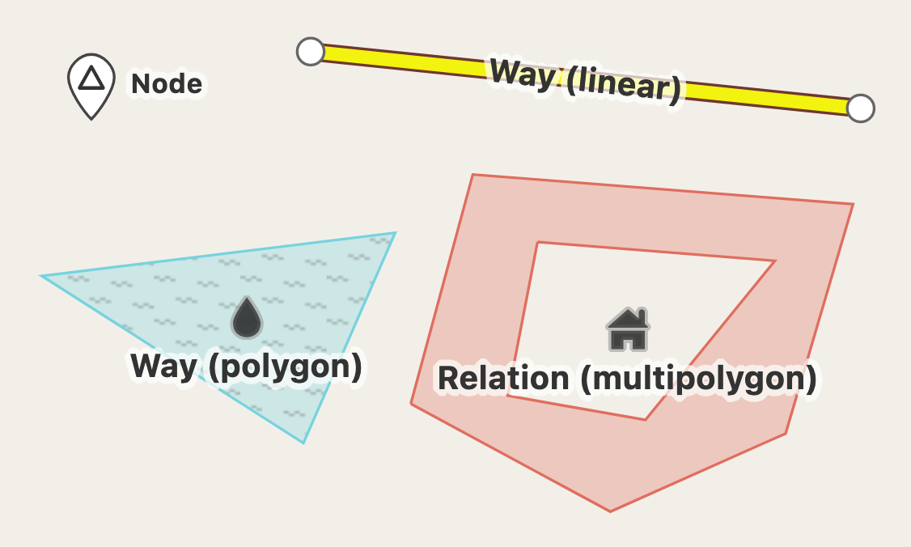

# openstreetmap-cheat-sheet
A cheat sheet for OSM users.

- OpenStreetMap
- Data
  + Data Structure
  + Data Quality
- Services
  + Map Tile
  + Data Extraction
  + Routing 
- Applications


### [Data Structure](https://en.wikipedia.org/wiki/OpenStreetMap#Data_structure)
OpenStreetMap uses a topological data structure, with four core elements (also known as data primitives):



- **Nodes** are points with a geographic position, stored as coordinates (pairs of a latitude and a longitude) according to WGS 84. Outside of their usage in ways, they are used to represent map features without a size, such as points of interest or mountain peaks.
- **Ways** are ordered lists of nodes, representing a polyline, or possibly a polygon if they form a closed loop. They are used both for representing linear features such as streets and rivers, and areas, like forests, parks, parking areas and lakes.
- **Relations** are ordered lists of nodes, ways and relations (together called "members"), where each member can optionally have a "role" (a string). Relations are used for representing the relationship of existing nodes and ways. Examples include turn restrictions on roads, routes that span several existing ways (for instance, a long-distance motorway), and areas with holes.
- **Tags** are **key-value pairs** (both arbitrary strings). They are used to store metadata about the map objects (such as their type, their name and their physical properties). Tags are not freestanding, but are always attached to an object: to a node, a way or a relation.

### [Routing (OSM-based)](https://wiki.openstreetmap.org/wiki/Routing)

- [Openrouteservice](https://openrouteservice.org/) (ORS) - free, open source library and API with many options and an ecosystem of further tools and libs for Javascript, R, Python, QGIS etc.
  + Dev dashboard: https://openrouteservice.org/dev/#/home
  + API documentation: https://openrouteservice.org/dev/#/api-docs
  + Features:
    + Directions (Long distance routes, Used by professionals, Geocoding, POIs)
    + Isochrones (Extraordinarily large areas, Multiple locations and intersections)
    + Time-Distance Matrix (Up to 2.500 distance pairs, Fast response times, Elevation)
    + Optimization (Capacities, Skills, Service duration & time windows, Priority)
    + Used with personal token
  + Usage
    + API
    Make sure you have personal usage token, which you can access from https://openrouteservice.org/dev/#/home.
    ```python
    # Get route by ORS API
    import requests

    headers = {
        'Accept': 'application/json, application/geo+json, application/gpx+xml, img/png; charset=utf-8',
    }

    API_KEY = "" # openrouteservice personal usage token
    START = {
        "longitude": 8.681495,
        "latitude": 49.41461
    }
    END = {
        "longitude": 8.687872,
        "latitude": 49.420318
    }

    url = f"https://api.openrouteservice.org/v2/directions/driving-car?api_key={API_KEY}&start={START['longitude']},{START['latitude']}&end={END['longitude']},{END['latitude']}"
    call = requests.get(url, headers=headers)

    print(call.status_code, call.reason)
    print(call.text) # geojson format
    ```
    + SDK
      + [Python ORS SDK](https://github.com/GIScience/openrouteservice-py)
      + [JavaScript ORS SDK](https://github.com/GIScience/openrouteservice-js)
      + [R ORS SDK](https://github.com/GIScience/openrouteservice-r)
      + [QGIS ORS plugin](https://plugins.qgis.org/plugins/ORStools/)


- [Open Source Routing Machine](http://project-osrm.org/) (OSRM)
  + Github repository: https://github.com/Project-OSRM
  + API documentation: http://project-osrm.org/docs/v5.10.0/api/#general-options
  + Usage
    + API
    ```python
    # Get route by OSRM API
    import requests

    START = {
        "longitude": 8.681495,
        "latitude": 49.41461
    }
    END = {
        "longitude": 8.687872,
        "latitude": 49.420318
    }

    url = f"http://router.project-osrm.org/route/v1/driving/{START['longitude']},{START['latitude']};{END['longitude']},{END['latitude']}?geometries=geojson"
    osrm = requests.get(url)

    print(osrm.status_code, osrm.reason)
    print(osrm.json()) # geojson format routes
    ```
    + Docker
      + [OSRM Backend](https://github.com/Project-OSRM/osrm-backend)
